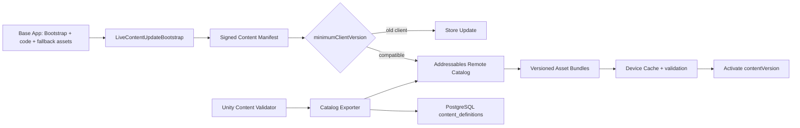

# Splice Live Content Update Architecture

สถานะ: U1 local-first implementation — Unity 6000.5.2f1, Addressables 3.1.0  
เป้าหมาย: เพิ่ม map, hero, faction และ season assets โดยผู้เล่นดาวน์โหลดเฉพาะทรัพยากรที่เปลี่ยน ไม่ต้องติดตั้งเกมใหม่ และยังไม่เสียค่า cloud/CDN ระหว่างพัฒนา

## 1. ขอบเขตการอัปเดต

อัปเดตแบบ content-only ได้:

- Scene/map, prefab, model, texture, material, animation, audio และ VFX
- ScriptableObject/config/balance ที่โค้ดในตัวเกมรู้วิธีอ่านอยู่แล้ว
- Hero/monster/tower ใหม่ที่ประกอบจาก component และ ability archetype ที่มีใน Player build
- Event, season และ cosmetic

ต้องออก Player build ผ่าน Store:

- C# gameplay code หรือ native plugin/SDK ใหม่
- permission, Unity/package upgrade หรือระบบที่ client เดิมไม่รู้จัก
- content schema ที่สูงกว่าที่ client รองรับ

ออกแบบ ability/effect ให้เป็น generic modules ตั้งแต่ต้นจะทำให้ hero ใหม่ส่วนใหญ่กลายเป็น content-only update ได้

## 2. Architecture

ฐานข้อมูลเป็น authority ของ ID, cost, Defense Capacity, stake และ reward เสมอ ข้อมูลใน bundle ใช้แสดงผล/จำลองเกมเท่านั้น

## 3. Addressables layout

| Group/label | หน้าที่ | Delivery |
|---|---|---|
| `core-local` | Bootstrap, updater, fallback UI/assets | อยู่ในแอป |
| `shared-remote` | dependency ที่หลาย pack ใช้ร่วม | remote |
| `map/<id>` | scene และ asset เฉพาะ map | remote/on-demand |
| `hero/<id>` | definition, prefab, animation/VFX เฉพาะ hero | remote/on-demand |
| `faction/<id>` | tower/monster/card ของ faction | remote |
| `season/<id>` | event/season content | remote |

ห้ามสร้าง bundle ใหญ่ก้อนเดียว แยก shared dependency เพื่อไม่ให้แก้ texture หนึ่งไฟล์แล้วผู้เล่นต้องโหลด map/hero ทั้งหมดใหม่

Local profile:

- Build path: `Splice/ServerData/[BuildTarget]`
- Load path: `http://127.0.0.1:8081/[BuildTarget]`
- Manifest: `http://127.0.0.1:8081/live-content-manifest.json`
- Production เปลี่ยนเฉพาะ profile/manifest host เป็น CDN; game code ไม่เปลี่ยน

## 4. Version contract

- `appBuildVersion`: binary ที่ Store แจก
- `contentVersion`: remote catalog/bundles เช่น `1.0.1`
- `manifestSchemaVersion`: รูปแบบ manifest ที่ client รองรับ
- `serverRulesVersion`: catalog ของ backend เช่น `content-c3-v1`
- `snapshotContentVersion`: version ที่ town/raid snapshot ใช้

Town snapshot และ raid session ต้อง pin content version; ห้ามลบ bundle/catalog เก่าทันที เก็บอย่างน้อยเท่าช่วงอายุ raid, replay และ rollback policy

## 5. Runtime flow

1. โหลด manifest จาก endpoint; dev fallback ไป embedded manifest
2. validate schema, semantic version, duplicate labels, SHA-256 และ production signature requirement
3. ถ้า `minimumClientVersion` สูงกว่า client ให้เปิด Store Update gate
4. กู้ pending activation ที่ crash ค้างด้วย last-known-good catalog
5. โหลด remote catalog
6. คำนวณขนาด pack ด้วย `GetDownloadSizeAsync`
7. ดาวน์โหลด mandatory labels พร้อม progress, retry สูงสุด 3 ครั้ง และ cancellation
8. smoke-load validation address และตรวจว่าทุก mandatory label มี asset
9. เขียน pending marker แล้ว activate version แบบ atomic
10. ถ้าล้มเหลว rollback catalog; embedded content เป็น fallback ชั้นสุดท้าย

## 6. Release pipeline

1. `Splice/Live Content/1` — configure Addressables groups/profile/probe
2. `Splice/Live Content/2` — Content Validator + deterministic backend catalog/SQL export
3. `Splice/Live Content/3` — full Addressables content build
4. `Splice/Live Content/4` — baseline → content-update build proof โดยไม่เรียก Unity Player build
5. Run EditMode + PlayMode tests
6. อัปโหลด bundles/catalog ไป immutable versioned path
7. import generated SQL ใน transaction
8. publish signed manifest เป็นขั้นสุดท้าย (atomic switch)

ห้าม overwrite bundle ที่ publish แล้ว ใช้ hashed filename และเก็บ `addressables_content_state.bin` ของทุก Player release เพื่อสร้าง content update รุ่นถัดไป

## 7. Security และ production gate

- HTTPS, host allow-list, SHA-256 และ asymmetric detached signature
- signing private key อยู่ใน CI secret เท่านั้น ห้ามอยู่ใน Unity project/client
- production manifest ที่ไม่มี catalog URL/hash/signature ต้อง fail closed
- backend ตรวจ ownership/cost/capacity ใหม่ทุก request; ห้ามเชื่อ ScriptableObject จาก client
- rollout แบบ staged percentage + metrics: download failure, rollback rate, catalog load time
- รองรับ cache quota, free-space check, Wi-Fi/cellular consent และ optional pack eviction ก่อนเปิดจริง

## 8. การทดสอบ U1

- EditMode: manifest compatibility, store gate, retry, rollback, deterministic export, required groups/probe
- PlayMode: โหลด validation probe ด้วย Addressables address
- Content-only proof: build baseline `1.0.0`, เปลี่ยน probe เป็น `1.0.1`, ใช้ `BuildContentUpdate`, ยืนยัน catalog hash เปลี่ยนและ `playerRebuildInvoked=false`
- Content Validator เป็น build gate; catalog ที่หายหรือ stale ทำให้ build ล้มเหลว

## 9. ขั้น production ภายหลัง

U1 ใช้ localhost จึงไม่มีค่าใช้จ่าย เมื่อเกมพร้อม deploy ค่อยเพิ่ม CDN/object storage, manifest API, CI signing, staged rollout, monitoring และ Android Play Asset Delivery สำหรับ initial large packs หากจำเป็น Addressables ยังคงเป็น cross-platform live-content authority หลัก
