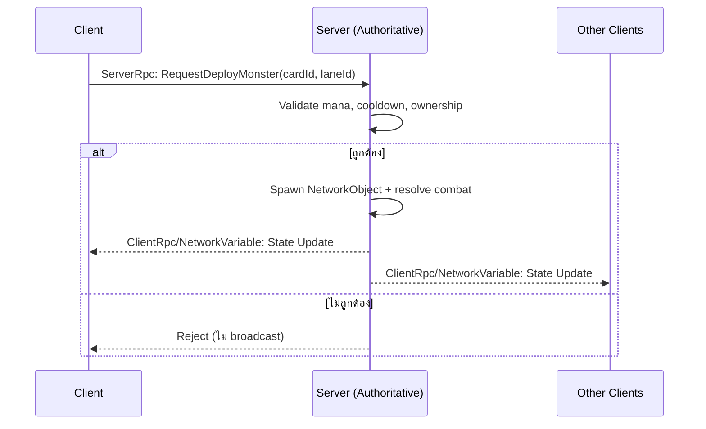

# เอกสารสถาปัตยกรรมเทคนิค — Reverse Tower Defense (Working Title)

**เวอร์ชัน:** 0.2 (Draft)

> **v0.2 (2026-07-10) — ปรับ Role Model ครั้งใหญ่:** Invader เล่นสดเป็นแกน / Defender เป็น async base-building รวมร่างกับ Lair / world map เสมือน (ไม่ใช้ GPS) — ดู §1.1 และ §5.10
**ทีม:** Solo Developer + AI Coding Agent
**แพลตฟอร์ม:** Mobile (iOS / Android)
**Engine:** Unity 6 LTS, C#

> **🟢 = อัปเดตล่าสุด / เพิ่งตัดสินใจหรือเพิ่งเขียนโค้ดเสร็จ ยังต้องไปประกอบต่อใน Unity** — มองหา 🟢 เพื่อดูจุดใหม่ (ทำใน Editor เสร็จแล้วลบ 🟢 ออกได้)

---

## 1. ภาพรวมโปรเจกต์

เกม Reverse Tower Defense แนว Roguelite Deckbuilder ผสม Idle Meta — ผู้เล่นควบคุมฝูงมอนสเตอร์บุกทำลายป้อมที่มีหอคอยป้องกัน ผ่านระบบ draft การ์ดแบบ run-based และมี "Lair" เป็น meta layer สำหรับอัพเกรดถาวรระหว่างรอบ

**โหมดเกม 3 เฟส (พัฒนาเรียงลำดับ):**

| เฟส | โหมด | คำอธิบาย |
|---|---|---|
| 1 | **PvE** | เล่นคนเดียว, ตัวยืนพื้นของเกม, ต้องเล่นสนุกและ retention ดีก่อน |
| 2 | **PvBot** | โครงสร้าง multiplayer จริงแต่เติม AI bot แทนผู้เล่น ใช้พิสูจน์ระบบ network |
| 3 | **PvP** | เปิด matchmaking ให้ผู้เล่นจริง 5 คนต่อแมตช์ |

หลักการสำคัญที่สุดของเอกสารนี้: **เขียนโค้ดครั้งเดียวให้รองรับทั้ง 3 เฟส** ไม่ต้อง refactor สถาปัตยกรรมใหม่ตอนเปลี่ยนเฟส

### 1.1 Role Model (v0.2)

| Role | รูปแบบการเล่น | เฟส |
|---|---|---|
| **Invader** | **เล่นสด (role หลัก)** — campaign PvE + raid ฐานผู้เล่นอื่นแบบ snapshot | 1 |
| **Defender** | **Async base-building** — จัดผังฐานล่วงหน้า (ป้อม + มอน garrison + economy) ระบบใช้ผังตั้งรับแทนตอนถูก raid ไม่ต้องออนไลน์ | 1 |
| Live PvP 1:1 (คุมสดสองฝ่าย) | โหมด endgame สำหรับผู้เล่น engaged | 3 |

- **ฐานผู้เล่น = Lair รวมร่าง** — ฐานเดียวเป็นทั้ง idle economy, เป้าหมายถูกปล้น, จุดจัดทัพ/แต่งผังป้อม (ดู 5.3, 5.10)
- **Raid ฐานคนอื่น = PvE ทางเทคนิค** — local host โหลด `BaseLayout` snapshot ของเป้าหมายมา spawn เป็นฝั่งตั้งรับ → ไม่ต้องมี dedicated server, ไม่มีปัญหา matchmaking cold start (เติมฐาน bot ได้)
- **มอนสเตอร์ตัวเดียวใช้ได้สองทาง** — จัดเข้าทัพบุก (`ArmyPreset`) หรือวางเฝ้าฐาน (garrison)
- **World map เสมือน** (ไม่ใช้ GPS จริง — ตัดปัญหา player density / privacy / spoofing) แบ่งเขตธีมจังหวัด, ขาย warp/ขยายรัศมีบุกเป็น monetization — ทำหลังจาก loop ปล้นพิสูจน์แล้วว่าสนุก
- **โค้ด (v0.2):** enum ฝั่งใน combat = `RaidSide { Attacker, Defender }` (เดิม `Team { Invaders, Defenders }`) — สื่อว่าเป็น **บทบาทต่อ raid** ไม่ใช่ฝ่ายถาวร. จอเริ่มเซสชันใช้ `FactionSelectionController` (เลือก/สลับ faction → เข้าเมือง) แทน `SideSelectionController` เดิม (deprecated เป็น dev tool)
- **Faction = loadout สลับได้ (ไม่ใช่ล็อกถาวร):** 1 บัญชีเป็นเจ้าของได้**หลาย faction** (`PlayerProfile.OwnedFactionIds`) + มี faction ที่ใช้อยู่ (`ActiveFactionId`) — สลับไปมาได้อิสระ, แต่ละเผ่ามี mastery/unlock ของตัวเอง (โบนัส mono-faction จูงใจให้เชี่ยวชาญเผ่าเดียว แต่ไม่บังคับ)
- **Multi-city (โมเดล B):** แต่ละ faction ที่ปลดล็อกมี **เมืองของตัวเอง 1 หลัง** (BaseLayout ต่อ factionId, เก็บแยก key ใน `PlayerBaseStore`). ปลดล็อก slot เมืองเพิ่มได้ (gate: level/IAP) แต่ **cap** (`PlayerProfile.MaxCitySlots`, ตอนนี้ 3) กัน attention เฉลี่ยบางเกิน + เงินเฟ้อเศรษฐกิจ. เศรษฐกิจแต่ละเมืองอิสระ

---

## 2. Tech Stack

| Layer | เทคโนโลยี | เหตุผล |
|---|---|---|
| Engine | Unity 6 LTS | Mobile build pipeline ดีที่สุดในตลาด, AI agent เขียนโค้ด C# ได้แม่นยำ (training data เยอะ) |
| Networking | Netcode for GameObjects (NGO) + Unity Transport | รองรับ Dedicated Server build target, server-authoritative ได้ในตัว |
| Data | ScriptableObject | Data-driven, AI agent generate content ได้ง่ายผ่าน JSON/CSV import |
| Local testing | Headless server build + ParrelSync | จำลอง multiplayer บนเครื่องเดียวโดยไม่ง้อ cloud |
| Hosting (production) | **ยังไม่ผูกมัด** — ดูหัวข้อ 10 | หลีกเลี่ยง vendor lock-in |

---

## 3. หลักการออกแบบสถาปัตยกรรม (Core Principles)

1. **Server-authoritative เสมอ** — ไม่ว่าโหมดไหน server (หรือ local host ในโหมด PvE) คือความจริงหนึ่งเดียว client ส่งได้แค่ "ความตั้งใจ" (intent)
2. **Codebase เดียว 3 โหมด** — PvE คือ NGO แบบ "local host" (client+server รวมโปรเซสเดียว ไม่ใช้เน็ต), PvBot/PvP คือ dedicated server จริง
3. **Hosting-agnostic** — ตัว server build ต้องรันได้กับ hosting provider ไหนก็ได้ โดยไม่แก้ game logic
4. **Content แยกจาก Logic** — ตัวเลขสมดุลเกม (stat มอนสเตอร์/หอคอย) อยู่ใน ScriptableObject ไม่ hardcode ในโค้ด

---

## 4. Network Architecture

### 4.1 Authority Model



**กฎเหล็ก:** client ไม่มีสิทธิ์ตัดสินผลลัพธ์ใดๆ เอง ทุกอย่าง (mana, damage, spawn, currency) ต้อง validate และคำนวณที่ server เท่านั้น — สำคัญมากเพราะมีเงินจริงผูกกับ IAP/currency

### 4.2 โหมดการรัน (Deployment Modes)

| โหมด | Host Type | Network | ใช้เมื่อไหร่ |
|---|---|---|---|
| PvE | Local Host (client+server โปรเซสเดียว) | Loopback (offline-capable) | เล่นคนเดียว |
| PvBot | Dedicated Server + AI bot fill | Localhost (dev) → Cloud (later) | ทดสอบ sync/latency ก่อนเปิด PvP |
| PvP | Dedicated Server + Matchmaker/Lobby | Cloud | เปิดให้ผู้เล่นจริง |

---

## 5. โครงสร้างระบบเกมหลัก

### 5.1 Combat / Raid System
- Session สั้น 2-4 นาที ผ่านด่านป้อม 3-5 ชั้นต่อรอบ (raid)
- Resource เป็น **ทอง (Gold) ขุดด้วย miner** ไม่ใช่ mana regen แบบ timer — รายละเอียดดู 5.7
- Win/Lose แยกตามโหมด (PvE run-based, PvP Fort vs Invader + Timer) — รายละเอียดดู 5.6

### 5.2 Draft / Roguelite System
- สุ่ม/draft มือการ์ดใหม่ทุกรอบ (server กำหนด seed เพื่อป้องกัน client-side manipulation)
- ปลดล็อกถาวรผ่าน Lair meta

### 5.3 Player Base = Lair (Idle + Collection + Defense) — v0.2 รวมร่าง
- ฐานผู้เล่นหนึ่งเดียวทำหน้าที่: **idle resource generation** + **คลัง/คราฟต์มอนสเตอร์** (โปร่งใส ไม่ใช้ gacha ปิดบัง odds) + **ผังป้องกัน** (ป้อม + มอน garrison) ที่ผู้เล่นอื่นมา raid ได้
- ทองที่ผลิต idle เก็บในฐาน → ถูกปล้นได้บางส่วน (loot %) → เหตุผลให้กลับเข้าเกม: เก็บทอง / ซ่อมแก้ผัง / แก้แค้น (revenge)
- อัพเกรดถาวร + cosmetic customization
- รายละเอียด data/flow ดู 5.10

### 5.4 Bot AI System (จุดสำคัญของ Phase 2)
- Bot เรียก RPC เดียวกับผู้เล่นจริงทุกเส้นทาง (ไม่มี shortcut แยก) เพื่อให้ code path ที่ทดสอบคือ code path จริงที่จะใช้กับผู้เล่นจริงใน PvP
- ใช้เติม slot ที่ขาดทั้งตอน dev-test และตอน CCU ต่ำใน production (แก้ปัญหา cold start)

### 5.5 Matchmaking & Role Selection (Phase 3)
- ให้ผู้เล่นเลือก role ที่อยากเล่น (monster / defender) ก่อนเข้าคิว ไม่ใช่สุ่มล้วน — ป้องกันปัญหา role imbalance แบบเคส Evolve (2015)
- ให้ incentive (reward โบนัส) กับ role ที่คนเลือกน้อยกว่าในแต่ละช่วงเวลา
- Bot-fill เป็น fallback เมื่อหา match จริงไม่ทันเวลา
- **Ranked/MMR: เลื่อนไปทำหลังสุด** ต้องมี player base มากพอก่อนถึงจะแมตช์ได้แฟร์

### 5.6 Game Modes & Win/Lose Conditions

**PvE (Roguelite Run):**
- เล่น run-based เป็น level/floor แต่ละ floor มี Fort เดียว (HP/ความยากเพิ่มตาม floor)
- แพ้ floor ไหน = จบ run ทันที (ไม่ retry floor นั้น), ชนะ floor = อัพเกรด/เพิ่มการ์ด แล้วไป floor ถัดไป
- จบ run เมื่อแพ้ หรือทะลุ floor สุดท้าย → กลับ Lair เก็บ currency (idle meta)
- **v0.2: ผู้เล่นเล่นสดฝั่ง Invader เป็นหลัก** — ฝั่ง Fort แบบคุมสดเก็บไว้สำหรับ dev/test และ live PvP (Phase 3); การตั้งรับของผู้เล่นจริงทำผ่านผังฐาน async (5.10)

**PvBot / PvP — เงื่อนไขจบเกม:**

| โหมด matching | Invader ชนะเมื่อ | Fort ชนะเมื่อ |
|---|---|---|
| **1:1** (ตรงข้ามกันเสมอ) | Fort แตก | Timer หมด **หรือ** invader ตกรอบ |
| **1 Fort : N Invader** (2:1, 4:1) | Fort แตก (ใครลงดาบสุดท้ายก็ได้ = objective ร่วม) | Timer หมด **หรือ** invader ตกรอบครบทุกคน |
| **1 Invader : N Fort** (2:1, 4:1) | ทำลาย **Core Fort กลาง** (มีอันเดียว ทั้งทีมช่วยกันป้องกัน) | Timer หมด **หรือ** invader ตกรอบ |

- ฝั่งที่เป็น "1" ในโหมด N:1 ออกแบบเป็น **boss archetype** (HP/พลังสูงกว่า) เพื่อ balance การโดนรุม
- โหมด 1 Invader : N Fort ใช้ **Core Fort กลางอันเดียว** ที่ทุกคนช่วยกันป้องกัน (แต่ละคนมีป้อมย่อยส่วนตัวได้ แต่เป้าหมายแพ้-ชนะผูกกับ Core กลาง)

**นิยาม "ตกรอบ" (elimination):** ผู้เล่นตกรอบเมื่อ **เสีย miner หมดทุกตัว + ทอง 0 + ไม่มี unit เหลือในสนาม** เท่านั้น (ไม่ใช่แค่ทองหมดชั่วคราว เพราะ miner ขุดทองคืนได้เรื่อยๆ)

**เมื่อผู้เล่นตกรอบในโหมดทีม (กันเบื่อ):**
- PvP → เปลี่ยนเป็น **support mode**: โอนทองที่เหลือให้เพื่อน / ping-scout แผนที่ / ปล่อย buff เพื่อนได้ครั้งเดียว (จบไว มีของเล่น ไม่ยืดแมตช์)
- PvBot / PvE → **respawn** miner ตั้งต้น + ทองก้อนเล็ก หลัง cooldown (ผ่อนปรน เหมาะกับการฝึกเล่น)
- 1:1 → ไม่มีปัญหานี้ ใครตกรอบ = จบแมตช์ทันที

**Implementation (1:1 ทำแล้ว):** `RaidManager` (server-authoritative) ถือ outcome/endReason/remainingSeconds เป็น NetworkVariable
- Invader ชนะ: subscribe `FortCore.Instance.OnDeath` → `MonstersWin`
- Fort ชนะ: `remainingSeconds` นับถอยหลังถึง 0 (`TimerExpired`) **หรือ** `IsInvaderEliminated()` = ไม่มี miner ทีม invader + `GoldController.CurrentGold == 0` + ไม่มี `MonsterCharacter` (`InvaderEliminated`)
- UI: `MatchTimerDisplay` (นับถอยหลัง), `RaidResultUI` (แพ้-ชนะ + เหตุผล). โหมด N:1 ยังไม่ทำ (ขยายทีหลัง)

### 5.7 Economy: Gold + Miner (แทน Mana)

- **ทอง (Gold) แทน Mana** เป็น resource หลักในการ deploy unit/การ์ด — cost การ์ดเปลี่ยนจาก manaCost → goldCost
- แต่ละทีมเริ่มด้วย **miner 1 ตัว + ทองตั้งต้น**
- **Miner** เป็น unit พื้นฐาน (สร้างเพิ่มได้ด้วยทอง) ใช้ NavMeshAgent — วงจร **carry-and-return**:
  1. วิ่งไปบ่อใกล้สุด → 2. ขุดจนเต็ม `carryCapacity` (ใช้เวลา `mineDurationSeconds`) → 3. วิ่งกลับ **ฐานของทีม (MinerBase)** → 4. ถึงฐานถึงจะฝากทองเข้า GoldController (ทองเพิ่มตอนนี้เท่านั้น)
  - บ่อหมดแล้วไปหาบ่อถัดไป; ยิ่งบ่อไกลฐาน = เที่ยวไป-กลับนาน = income ช้าลง (trade-off เชิงพื้นที่ต่อเนื่อง ไม่ใช่แค่ตอนเริ่ม)
  - ทองจะ **ไม่เข้าทีม** จนกว่า miner จะถึงฐาน → ฆ่า miner ที่กำลังแบกทองกลับ = ตัด income ก้อนนั้นทิ้ง (economic warfare)
- เกิดแนวเล่น **สงครามเศรษฐกิจ** — ไล่ฆ่า miner คู่แข่งเพื่อตัด income เป็นอีกเส้นทางสู่ชัยชนะ (ตกรอบ) นอกจากการทุบ Fort
- gold/miner เป็น **per-team** → ต้องมี concept "team" ใน server state (server-authoritative ทั้งยอดทองและตำแหน่ง miner)

**Component ที่ต้องเพิ่ม/แก้ (แทน `ManaController`):**
- `GoldController` — ยอดทองต่อทีม (NetworkVariable, server write)
- `GoldNode` — บ่อทองบนแผนที่ มีปริมาณจำกัด ขุดหมดแล้วปิด
- `MinerBase` — จุดส่งทองต่อทีม (drop-off) ที่ miner วิ่งกลับมาฝาก
- `MinerCharacter` — unit ที่ pathfind → ขุดเต็ม load → วิ่งกลับ MinerBase → ฝากทองเข้า GoldController ของทีมตัวเอง

**ลำดับการทำ:** ทำ **core loop 1:1 (ทอง + miner + team) ให้เสร็จก่อน** แล้วค่อยขยายเป็น 2:1 / 4:1 (เขียน team/gold/miner รอบเดียวรองรับได้หมด, matching หลายคนต่อยอดทีหลัง)

### 5.8 Movement & Pathing Model

**ระบบเดินสองแบบ ตั้งใจแยกตามหน้าที่ (ไม่ใช้ NavMesh กับทุกอย่าง):**

| Unit | ระบบเดิน | เหตุผล |
|---|---|---|
| **Monster** (invader) | **Waypoint ตายตัวต่อเลน** (`LanePath`) | เส้นทาง author ไว้ในแต่ละ map, ป้อม **ไม่บล็อก/ไม่ reroute** → เดินตรง ไม่ติดซอก ไม่ต้องพึ่ง arrival hack ของ NavMesh |
| **Miner** | **NavMesh อิสระ** | เป้าหมาย dynamic (บ่อใกล้สุดที่ยังไม่หมด เปลี่ยนไปเรื่อยๆ) → ให้ NavMesh หาเส้นเอง, เดินในพื้นที่โล่งจึงไม่ติดซอก |

- **โมเดล monster = "เดินหน้าไม่หยุด + ยิงระหว่างผ่าน" (advance-and-shoot):** monster เดินตาม `LanePath` ไปฐานตลอดโดยไม่หยุด และ**ขนาน**กันจะโจมตี `TowerCharacter` (รวม Fort เพราะ `FortCore` เป็น subclass) ที่อยู่ในระยะ — การยิงไม่บล็อกการเดิน
  - **ไม่มี stalemate:** monster คืบเข้าฐานเสมอ → แรงกดดันต่อเนื่อง balance ด้วยเศรษฐกิจสองฝั่ง
  - ป้อมโดน damage ระหว่างทาง → **ป้อมแตกได้** → ฝั่ง Fort ต้องซ่อม/วางใหม่ (counterplay สองทาง)
- **Defender deploy flow (วางป้อมด้วยทอง):** วางป้อมที่ **ตำแหน่งอิสระ** (ไม่ผูกเลน เพราะป้อมไม่ reroute แค่ต้องอยู่ในระยะยิงเลน) — client tap เลือกตำแหน่ง, server validate ทอง (`TowerDeploymentManager`, team=Defenders) แล้ว spawn
  - `TowerDefinitionSO.goldCost`, `TowerDatabaseSO` (catalog resolve towerId → def), `TowerDeploymentManager` (ServerRpc), `TowerPlacementInputController` (client intent)
- 🟢 **กดป้อม → เมนู icon (ซ่อม / อัพเกรด / ทำลาย — ทำแล้ว):** tap ป้อม → `TowerInteractionController` เปิดเมนูติดตัวป้อม, แต่ละปุ่มยิง ServerRpc แยก (server คิดทอง/validate ทุกครั้ง). ทุกค่า factor เป็น serialized field ชั่วคราว รอย้ายเข้า main config (ข้อ B)
  - **ซ่อม** `RequestRepairTowerServerRpc` → heal เต็ม, ค่าซ่อม = `ceil(goldCost × HPที่หาย/maxHP × repairFactor)` (ปัดขึ้น, default repairFactor=0.5). ใช้ `CharacterBase.Heal()` (server-only, clamp ≤ MaxHealth, ตายแล้วซ่อมไม่ได้). ซ่อม Fort ได้ (FortCore เป็น TowerCharacter)
  - **ทำลาย** `RequestDemolishTowerServerRpc` → despawn คืนพื้นที่, คืนทอง = `floor(goldCost × HPเหลือ/maxHP × demolishRefundFactor)` (ปัดลง 0.5→0, default factor=1). **ห้ามทำลาย Fort**
  - **อัพเกรด** `RequestUpgradeTowerServerRpc` → หัก `TowerDefinitionSO.upgradeCost` (ตายตัวต่อ tier) แล้ว despawn ตัวเก่า + spawn `nextTier` ที่ตำแหน่งเดิม **HP เต็มของ gen ใหม่**. `nextTier` ว่าง = max level. **Fort อัพเกรดไม่ได้**
  - ราคาซ่อม/คืนเงินผูกกับ `goldCost` (ราคาสร้าง) เป็นฐาน → ไม่ต้องตั้งเลขซ่อมแยกทุกป้อม; tier chain ทำผ่าน `TowerDefinitionSO.nextTier` (SO แยกต่อ gen มี prefab/stat ของตัวเอง)

**Component การเดิน/deploy:**
- `LanePath` — waypoint เรียงลำดับต่อเลน (map-authored)
- `MonsterCharacter` — waypoint mover (ไม่มี NavMeshAgent แล้ว) + attack แบบไม่บล็อก
- `DeploymentManager` — spawn monster ตาม `lanePaths[laneId]` (invader)
- `TowerDeploymentManager` — วางป้อม + ซ่อม/อัพเกรด/ทำลาย (ServerRpc ทั้งหมด, defender)
- `TowerPlacementInputController` — tap วางป้อมใหม่; `TowerInteractionController` — tap ป้อมเดิม → เมนู ซ่อม/อัพเกรด/ทำลาย

---

### 5.9  Presentation & Orientation

**Target orientation = Portrait (แนวตั้ง) ล็อกทุกโหมด** — เลือกตามหลักการเล่น:
- เลนวิ่งตามแนวยาว (spawn → Fort) แมปกับจอสูงตรงๆ แบบ Clash Royale
- เซสชัน 2–4 นาที + เล่นมือเดียว → UI สำคัญ (การ์ด, ปุ่มวางป้อม, gold) อยู่ **ครึ่งล่างจอ** ให้นิ้วโป้งกดถึง → retention ดีกว่า
- ต้นทุนพัฒนาต่ำ: จอเดียว ไม่รองรับหมุนจอ

**เลือกฝั่งตอนเริ่มเกม (Fort / Monster) + camera สลับข้าง:**
- map สร้างแบบ **reverse** (สองฝั่งอยู่คนละปลาย) → ตอนเริ่มโชว์ UI ถามว่าจะเล่นฝั่ง **Fort** หรือ **Monster**
- เลือกแล้ว: (1) เปิด controller + UI ของฝั่งนั้น ปิดของอีกฝั่ง, (2) **สลับ camera** ไปกล้องของฝั่งนั้น (มองเข้าหาสนามจากปลายของตัวเอง)
- `SideSelectionController` (client-side/presentation): ฟิลด์กล้อง **แยก 3 ตัว** `overviewCamera` (ตอนเลือก, เว้นว่างได้→ใช้ `fortCamera` เป็น backdrop) / `fortCamera` / `monsterCamera`, และ `fortObjects`/`monsterObjects` (GameObject[] = controller+UI ต่อฝั่ง), ปุ่มเรียก `ChooseFort()`/`ChooseMonster()`
- **สลับกล้องด้วย `GameObject.SetActive` ทีละตัว** (เปิดแค่กล้องที่เลือก ปิดอีกสองตัว) → เปิด AudioListener แค่ตัวเดียว **แก้ warning "There are N audio listeners in the scene"** ไปในตัว
- ⚠️ ห้ามวาง `SideSelectionController` ไว้บน Panel ที่มันต้องปิด/เปิด หรือบน GameObject ที่ inactive — `Start()` จะไม่รัน แล้ว UI เลือกฝั่งจะไม่โผล่ (วางบน GameObject ที่ active เสมอ เช่น manager กลาง); ต้องมี Canvas + EventSystem ในซีน
- ขอบเขตปัจจุบัน: local เท่านั้น (PvE host คุมสองฝั่งอยู่แล้ว — นี่แค่เลือกว่า client นี้คุม/มองฝั่งไหน) PvP จริงจะ assign ฝั่งจาก server ทีหลัง

** กล้อง Free-pan + กติกา deploy/build (ทั้งสองฝั่ง):**
- เลนยาวกว่าจอ + มุมกล้อง 3D ~50° (ตัวละครเห็นชัด) → **เห็นทั้งแมปในจอเดียวไม่ได้** จึงให้ **กล้อง free-pan** เลื่อนดูทั่วแมปด้วย **tap + slide** ทั้งฝั่ง Fort และ Invader
- มีปุ่ม **Home** = quick กลับไปโฟกัสฐาน/บ้านตัวเอง กรณี pan ออกไปไกล
- **Invader (deploy อิงเลน ไม่อิงตำแหน่งนิ้ว):** สั่ง deploy ได้**ทุกที่ที่กล้องอยู่** — กดเลือกมอน → เลือกเลน → ลงเลย → นั่งดูป้อมปะทะไกลๆ พร้อมสั่งลงมอนจากตรงนั้นได้เลย
- **Fort (วางป้อมอิงพิกัดจริงบน build surface):** pan ไปดูแนวรบที่กำลังเข้ามาได้ **แต่วางป้อมไม่ได้ถ้าไม่อยู่ที่ฐาน** — ต้องกด **Home** กลับไปวาง (เพราะวางป้อมต้อง raycast แตะตำแหน่งจริง กล้องต้องอยู่ที่ build zone)
- เหตุผลที่กติกาต่างกัน: deploy = เลือก "เลน" (abstract) ทำจากที่ไหนก็ได้ / วางป้อม = แตะพิกัดบนพื้น ต้องอยู่ที่ฐาน
- โค้ดพร้อมแล้ว: `CameraPanController` (แปะที่กล้องแต่ละฝั่ง — tap+slide เลื่อน + clamp X/Z ตาม `BoxCollider panBounds` (กล่องขอบเขตแมป มี gizmo ปรับด้วยมือจับ), `GoHome()` สำหรับปุ่ม Home, `IsAtHome` ให้ฝั่ง Fort เช็ค), และ `TowerPlacementInputController` มี field `cameraPan` guard วางป้อมได้เฉพาะตอนอยู่ที่ฐาน. เหลือประกอบใน Unity (ดู README 6.1) + ยังไม่ได้ทำ "invader deploy อิงเลนจาก UI" (ตอนนี้ยัง tap lane marker ในโลก)

**โหมด 4:1 — โมเดล "จอเดียว + วาร์ปดูบ้านคนอื่น" (แก้ความแออัด):**
- ค่าเริ่มต้นผู้เล่นเห็น **เฉพาะบ้านตัวเอง** เต็มจอ — ไม่ render บ้านผู้เล่นอื่นพร้อมกัน จึงไม่แออัด
- กด **avatar ผู้เล่นอื่น** → "วาร์ป" ไปดูบ้านของเขา แล้วสลับกลับบ้านตัวเองได้
- ฝ่ายตรงข้ามก็วาร์ปมาดูได้เช่นกัน → **ทุกฝ่ายดูกันได้หมด** แต่ทีละบ้านในจอเดียว
- นัยเชิงเทคนิค: camera/view สลับเป้าหมายตาม avatar ที่เลือก (ไม่ใช่ split-screen); state ทุกบ้าน sync ผ่าน server อยู่แล้ว แค่ควบคุมว่าจะ render/focus บ้านไหน

---

### 5.10 Player Base & Async Raid (v0.2)

**แกน loop:** จัดฐาน (async) → เก็บผังเป็น snapshot → ผู้เล่นอื่นกด raid → local host โหลด snapshot มา spawn ฝั่งตั้งรับ → จบแมตช์คิด loot → ผลสะท้อนกลับที่ฐานเจ้าของ (เสียทองส่วน loot, ได้ replay/revenge ภายหลัง)

**Data model (serializable JSON ต่อผู้เล่น — ไม่ใช่ ScriptableObject เพราะไม่ใช่ content):**
- `BaseLayout` — ผังฐาน 1 ชุด: รายการป้อม (towerId composite + ช่อง grid + upgrade levels), มอน garrison (cardId composite + ตำแหน่ง), จำนวน miner, ทองในคลัง
- `ArmyPreset` — ทัพบุกจัดไว้ล่วงหน้า (บันทึกหลายชุด แก้ไขได้ เลือกก่อนกด raid)
- id ทุกตัวเป็น composite id ของ `FactionRegistrySO` (`factionId/localId`) → snapshot อยู่รอดข้ามการเพิ่ม/ลบ content

**Components:**
- `PlayerBaseStore` — save/load `BaseLayout` + `ArmyPreset` (Phase 1: local JSON ผ่าน PlayerPrefs → cloud save เมื่อเข้า Phase 2)
- `RaidSnapshotLoader` — ฝั่ง server ตอนเริ่ม raid: อ่าน `BaseLayout` → spawn ป้อม (ตำแหน่ง grid + apply upgrade levels) + garrison + miner ของฝั่งตั้งรับ
- Build Mode (defender) — จัดผังเมืองนอกแมตช์ (ไม่มี network) ใช้กติกา grid เดียวกับ `TowerDeploymentManager` (`BuildGrid`) วางป้อม+มอน garrison → **auto-save** เป็น `BaseLayout`. มี pan+zoom (`CameraPanController`), grid overlay โชว์ช่องที่วางได้, ปุ่ม Cancel (มือถือ — เลิกถือของ)
- **พื้นที่วางเมือง = สี่เหลี่ยมจัตุรัส fix ตายตัวแต่แรก** (`BuildGrid.halfExtentCells`) วางได้เฉพาะในกรอบ; เล่นไปสักพัก **ซื้อพื้นที่เพิ่ม = ขยายเมือง** (เพิ่ม extent — soft-currency sink, ขั้น 5.5)
- **เศรษฐกิจสร้างเมือง (ขั้น 5.5 — checkout model):** วาง/อัพเกรดแบบ **draft อิสระ** → โชว์ **ยอดรวม temp** (cost เฉพาะชิ้นใหม่/อัพเกรด = diff จากที่ commit ไว้ ไม่จ่ายซ้ำทั้งเมือง) → ทองไม่พอสำหรับชิ้นถัดไป = **ปิดการสร้างเพิ่ม** → ปุ่ม **Checkout** ยืนยัน "จ่าย X" → หัก **meta gold** + commit + persist; ปุ่ม **Discard** ทิ้ง draft กลับ commit ล่าสุด. ย้ายชิ้นที่จ่ายแล้ว = ฟรี
  - **meta gold = สกุลถาวรข้ามแมตช์** (เก็บใน profile/wallet) — **คนละตัวกับทองในแมตช์** (`GoldController` จาก miner ที่รีเซ็ตทุก raid). อย่าปนกัน
  - ⚠️ **ต้อง server-authoritative (DB) ก่อนเปิดเศรษฐกิจจริง/PvP:** PlayerPrefs (Phase 1) แก้ง่าย → เชื่อ client ไม่ได้. client ส่งแค่ intent "checkout ผังนี้" → **server คิดเงิน+หัก+validate+เซฟเอง** (เหมือน IAP/currency §7, anti-cheat §10). Phase 1 local ก่อน แล้ว migrate

> 🔴🔴 **[BALANCE — จุดสำคัญมาก] Defense Capacity: เพดานฝ่ายรับผูกกับ "level ไม่ใช่เงิน"** 🔴🔴
>
> **ปัญหา (defense snowball):** ถ้าให้สร้าง garrison/ป้อมได้ตามเงิน → คนเงินเยอะสร้างเต็มผัง + อัพแกร่งจนคนอ่อนตีไม่เข้า → balance/matchmaking พัง + กลายเป็น pay-to-win
>
> **กติกาแก้:** ความแข็งฝ่ายรับ (จำนวน/ค่ารวม garrison + ป้อม) จำกัดด้วย **`DefenseCapacity` = f(baseLevel)** — **เงินแค่ "เติม/อัพภายในเพดาน"** ไม่ใช่ตัวกำหนดเพดาน (เงินจริงห้ามซื้อความแข็งฝ่ายรับ §7). แต่ละชิ้นกิน capacity (`defenseCapacityCost` ใน SO); วางเกินเพดานไม่ได้. เพิ่มเพดาน = **อัพ base level (progression/เวลา)** ไม่ใช่จ่ายทอง
>
> **เลเยอร์คุมเพิ่ม (ใช้ร่วม):**
> 1. **Area cap** (ขนาด floor) — วางได้จำกัดตามผัง
> 2. **Footprint trade-off** — มอน/ป้อมแกร่ง = กินที่เยอะ = วางได้น้อยตัว (แกร่ง↔จำนวน)
> 3. **Matchmaking by base-strength + loot scaling** — ป้อมแกร่งเจอผู้บุกแกร่ง (มือใหม่ไม่เจอ), ปล้นฐานแกร่งกว่า = loot เยอะกว่า
> 4. **ผู้บุกสเกลตาม level** — เป้า: **defender กันได้ ~50% ไม่ใช่ 100%** (async = เสีย loot ไม่เสียเมือง)
>
> **โค้ด:** `BaseBuildManager.DefenseCapacity`/`UsedCapacity`/`HasCapacityFor` + `defenseCapacityCost` ใน `TowerDefinitionSO`/`MonsterDefinitionSO` + `PlayerProfile.BaseLevel(factionId)` (โครงขั้นต้น — ยังไม่มีระบบ level-up, ตั้งค่า capacity ผ่าน baseLevel ได้)
- Garrison — `MonsterCharacter` โหมดเฝ้าตำแหน่ง (ไม่เดินเลน) ตื่นสู้เมื่อศัตรูเข้าระยะ

**Matchmaking = รายการ snapshot ไม่ใช่ realtime:** ดึงรายชื่อฐานเป้าหมาย (ผสมฐาน bot ที่ generate ไว้ → ไม่มี cold start) — Phase 1 ใช้ list local ก่อน

**กติกากัน exploit (self-farming / รุมโกง) — server-authoritative ทั้งหมด:**
1. **1 raid = 1 faction/1 ทัพ vs 1 snapshot** — ห้ามรวมทัพข้ามเผ่าในศึกเดียว (กันรุมไม่แฟร์ต่อ defender)
2. **attacker ≠ defender account** (`ownerAccountId`) — เมืองของบัญชีเดียวกัน **บุกกันเองไม่ได้** (กัน self-farming โยกทรัพยากร/ฟาร์มถ้วยจากเมืองตัวเอง)
3. **shield + diminishing loot + cooldown ต่อคู่ (ผู้ตี–เป้า)** — ตีเป้าเดิมซ้ำ = loot ลดจนไม่คุ้ม → ไม่มีเหตุจะสแปม (ตีซ้ำด้วยคนละเผ่าก็เป็นคนละ raid กับ snapshot ที่รีเซ็ต ไม่ได้แรงขึ้น)
4. **matchmaking แจกเป้าตาม rating/trophy** — เลือกจิ้มเป้าเจาะจงซ้ำๆ ไม่ได้อิสระ (กัน harassment + collusion ข้ามคน)

**World Map เสมือน (ทำหลัง loop พิสูจน์):** ฐานทุกคนอยู่บนแผนที่ shared world ที่ระบบคุมความหนาแน่นเอง (เขตละหลักร้อยฐาน + bot เติมให้ดูมีชีวิต), ผู้เล่นเลือกจังหวัดตอนสมัคร → เขต/leaderboard ภูมิภาค (**ไม่ track GPS**), monetization: warp ข้ามเขต / ขยายรัศมีบุก / ย้ายฐาน

---

## 6. Data Architecture

```
JSON/CSV (balance formula, AI agent generate)
        ↓ import script
ScriptableObject assets
   ├─ MonsterDefinitionSO
   ├─ TowerDefinitionSO
   └─ CardDefinitionSO
        ↓ reference
Runtime Systems (Combat, Draft, Lair)
```

- Save data PvE: local (JSON/PlayerPrefs)
- Save data PvBot/PvP: cloud save (เพิ่มทีหลัง เมื่อเปิด multiplayer จริง เพื่อรองรับ cross-device)

---

## 7. Monetization Hooks ในสถาปัตยกรรม

| Hook | ตำแหน่งใน Architecture | ข้อควรระวัง |
|---|---|---|
| Rewarded ad revive | Server validate ad-completion token ก่อน grant HP คืน | ห้าม client self-report ว่าดูโฆษณาจบแล้ว |
| IAP currency | Server-side receipt validation | ป้องกัน fraud/replay attack |
| Battle pass XP | Server-authoritative progress tracking | — |
| PvP cosmetics | Cosmetic-only ห้ามมีผลต่อ stat ในโหมด PvP | ผู้เล่นจ่ายเงินไม่ควรได้เปรียบคู่แข่งจริง (ความเชื่อมั่นของโหมด PvP) |

---

## 8. Local Development Workflow

1. Build โปรเจกต์เป็น **Dedicated Server build target** (`-batchmode -nographics`)
2. รัน client build แยกต่างหาก connect ไปที่ `127.0.0.1`
3. ทดสอบหลาย client พร้อมกันด้วย **ParrelSync** (clone โปรเจกต์ใน Editor) หรือ standalone build หลายชุด
4. ใช้ **Multiplayer Play Mode** (ฟีเจอร์ใน Editor) สำหรับเทสเร็วๆ โดยไม่ต้อง build ทุกครั้ง

---

## 9. Production Deployment Path (Phase 2-3)

- Server build เดิม (ไม่แก้โค้ด) → deploy ขึ้น hosting provider ที่เลือก
- ตัวเลือก hosting ที่ต้องพิจารณาใกล้ Phase 2-3 (**ยังไม่ต้องตัดสินใจตอนนี้**):
  - Rocket Science Group (ผู้สืบทอด Unity Multiplay Hosting)
  - Edgegap, Hathora, PlayFab Multiplayer Servers
  - self-managed VPS + Agones (คุมเองได้มากสุด งบต่ำสุด แต่ต้องดูแล ops เอง)
- เกณฑ์เลือก: ราคาต่อ concurrent match, ความง่ายในการ integrate กับ Netcode for GameObjects, region coverage (SEA สำคัญถ้า target ตลาดไทย/เอเชียตะวันออกเฉียงใต้)

---

## 10. Security & Anti-Cheat

- Server-authoritative ทุก state ที่มีผลต่อผลแพ้ชนะหรือเงิน
- Validate ทุก RPC input: range check, cooldown check, ownership check
- Rate-limit RPC calls ป้องกัน spam/exploit
- ห้าม trust ค่าจาก client แม้แต่ค่าที่ "ดูไม่อันตราย" เช่น timestamp หรือ mana ปัจจุบัน

---

## 11. Risk & Mitigation

| ความเสี่ยง | Mitigation |
|---|---|
| Unity ecosystem เปลี่ยนแปลง (เช่น Multiplay Hosting ปิดตัวไปแล้ว) | เขียน server build แบบ generic ไม่ผูก vendor lock-in (ดูหัวข้อ 9) |
| Cold start ปัญหา PvP หาแมตช์ไม่ติด | Bot-fill system + เปิด PvP หลังจาก PvE มี player base ระดับหนึ่งแล้ว |
| Role imbalance แบบเคส Evolve | Role selection + incentive queue (ดูหัวข้อ 5.5) |
| Desync/latency bug ใน production | ไล่จับให้หมดในเฟส PvBot ก่อนเปิด PvP จริง |

---

## 12. Roadmap ผูกกับ Architecture Milestone

| เฟส | ช่วงเวลาโดยประมาณ | Architecture Milestone |
|---|---|---|
| 1: PvE | เดือน 1-4 | NGO local-host, ScriptableObject data pipeline, Lair meta, draft system |
| 2: PvBot | เดือน 5-6 | Dedicated server (local/VPS), Bot AI ผ่าน RPC เดียวกับ player, sync/latency testing |
| 3: PvP | หลัง launch PvE และมี player base | Matchmaker/Lobby, hosting provider จริง, role queue + bot-fill, (ranked ทีหลังสุด) |

---

## 13. Open Decisions (รอตัดสินใจภายหลัง)

- [ ] เลือก hosting provider ตัวจริง (ตัดสินใจตอนใกล้ Phase 2)
- [ ] ชื่อโปรเจกต์ทางการ / ธีมโลก (necromancer? zombie? สัตว์ประหลาดแฟนตาซี?)
- [ ] รายละเอียดระบบ Ranked (ออกแบบตอนใกล้ Phase 3)
- [ ] Cloud save provider (Firebase / PlayFab / อื่นๆ) — ตัดสินใจตอนเริ่ม Phase 2
