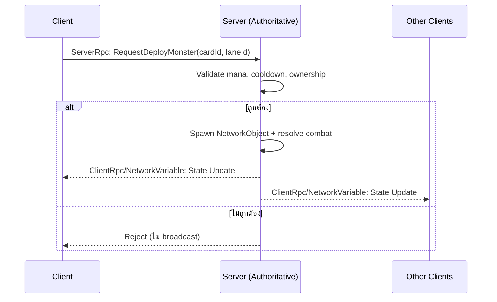

# เอกสารสถาปัตยกรรมเทคนิค — Reverse Tower Defense (Working Title)

**เวอร์ชัน:** 0.1 (Draft)
**ทีม:** Solo Developer + AI Coding Agent
**แพลตฟอร์ม:** Mobile (iOS / Android)
**Engine:** Unity 6 LTS, C#

---

## 1. ภาพรวมโปรเจกต์

เกม Reverse Tower Defense แนว Roguelite Deckbuilder ผสม Idle Meta — ผู้เล่นควบคุมฝูงมอนสเตอร์บุกทำลายป้อมที่มีหอคอยป้องกัน ผ่านระบบ draft การ์ดแบบ run-based และมี "Lair" เป็น meta layer สำหรับอัพเกรดถาวรระหว่างรอบ

**โหมดเกม 3 เฟส (พัฒนาเรียงลำดับ):**

| เฟส | โหมด | คำอธิบาย |
|---|---|---|
| 1 | **PvE** | เล่นคนเดียว, ตัวยืนพื้นของเกม, ต้องเล่นสนุกและ retention ดีก่อน |
| 2 | **PvBot** | โครงสร้าง multiplayer จริงแต่เติม AI bot แทนผู้เล่น ใช้พิสูจน์ระบบ network |
| 3 | **PvP** | เปิด matchmaking ให้ผู้เล่นจริง 5 คนต่อแมตช์ |

หลักการสำคัญที่สุดของเอกสารนี้: **เขียนโค้ดครั้งเดียวให้รองรับทั้ง 3 เฟส** ไม่ต้อง refactor สถาปัตยกรรมใหม่ตอนเปลี่ยนเฟส

---

## 2. Tech Stack

| Layer | เทคโนโลยี | เหตุผล |
|---|---|---|
| Engine | Unity 6 LTS | Mobile build pipeline ดีที่สุดในตลาด, AI agent เขียนโค้ด C# ได้แม่นยำ (training data เยอะ) |
| Networking | Netcode for GameObjects (NGO) + Unity Transport | รองรับ Dedicated Server build target, server-authoritative ได้ในตัว |
| Data | ScriptableObject | Data-driven, AI agent generate content ได้ง่ายผ่าน JSON/CSV import |
| Local testing | Headless server build + ParrelSync | จำลอง multiplayer บนเครื่องเดียวโดยไม่ง้อ cloud |
| Hosting (production) | **ยังไม่ผูกมัด** — ดูหัวข้อ 10 | หลีกเลี่ยง vendor lock-in |

---

## 3. หลักการออกแบบสถาปัตยกรรม (Core Principles)

1. **Server-authoritative เสมอ** — ไม่ว่าโหมดไหน server (หรือ local host ในโหมด PvE) คือความจริงหนึ่งเดียว client ส่งได้แค่ "ความตั้งใจ" (intent)
2. **Codebase เดียว 3 โหมด** — PvE คือ NGO แบบ "local host" (client+server รวมโปรเซสเดียว ไม่ใช้เน็ต), PvBot/PvP คือ dedicated server จริง
3. **Hosting-agnostic** — ตัว server build ต้องรันได้กับ hosting provider ไหนก็ได้ โดยไม่แก้ game logic
4. **Content แยกจาก Logic** — ตัวเลขสมดุลเกม (stat มอนสเตอร์/หอคอย) อยู่ใน ScriptableObject ไม่ hardcode ในโค้ด

---

## 4. Network Architecture

### 4.1 Authority Model



**กฎเหล็ก:** client ไม่มีสิทธิ์ตัดสินผลลัพธ์ใดๆ เอง ทุกอย่าง (mana, damage, spawn, currency) ต้อง validate และคำนวณที่ server เท่านั้น — สำคัญมากเพราะมีเงินจริงผูกกับ IAP/currency

### 4.2 โหมดการรัน (Deployment Modes)

| โหมด | Host Type | Network | ใช้เมื่อไหร่ |
|---|---|---|---|
| PvE | Local Host (client+server โปรเซสเดียว) | Loopback (offline-capable) | เล่นคนเดียว |
| PvBot | Dedicated Server + AI bot fill | Localhost (dev) → Cloud (later) | ทดสอบ sync/latency ก่อนเปิด PvP |
| PvP | Dedicated Server + Matchmaker/Lobby | Cloud | เปิดให้ผู้เล่นจริง |

---

## 5. โครงสร้างระบบเกมหลัก

### 5.1 Combat / Raid System
- Session สั้น 2-4 นาที ผ่านด่านป้อม 3-5 ชั้นต่อรอบ (raid)
- Mana regen เป็น server-side timer (authoritative) ป้องกันการโกงความเร็วรีเจน
- Win/Lose: ทำลายหัวใจป้อม vs ฝูงมอนสเตอร์ HP หมด

### 5.2 Draft / Roguelite System
- สุ่ม/draft มือการ์ดใหม่ทุกรอบ (server กำหนด seed เพื่อป้องกัน client-side manipulation)
- ปลดล็อกถาวรผ่าน Lair meta

### 5.3 Lair Meta System (Idle + Collection)
- Resource generation แบบ idle
- ฟักไข่/คราฟต์มอนสเตอร์ใหม่ — **ใช้ระบบโปร่งใส ไม่ใช้ gacha ปิดบัง odds**
- อัพเกรดถาวร + cosmetic customization

### 5.4 Bot AI System (จุดสำคัญของ Phase 2)
- Bot เรียก RPC เดียวกับผู้เล่นจริงทุกเส้นทาง (ไม่มี shortcut แยก) เพื่อให้ code path ที่ทดสอบคือ code path จริงที่จะใช้กับผู้เล่นจริงใน PvP
- ใช้เติม slot ที่ขาดทั้งตอน dev-test และตอน CCU ต่ำใน production (แก้ปัญหา cold start)

### 5.5 Matchmaking & Role Selection (Phase 3)
- ให้ผู้เล่นเลือก role ที่อยากเล่น (monster / defender) ก่อนเข้าคิว ไม่ใช่สุ่มล้วน — ป้องกันปัญหา role imbalance แบบเคส Evolve (2015)
- ให้ incentive (reward โบนัส) กับ role ที่คนเลือกน้อยกว่าในแต่ละช่วงเวลา
- Bot-fill เป็น fallback เมื่อหา match จริงไม่ทันเวลา
- **Ranked/MMR: เลื่อนไปทำหลังสุด** ต้องมี player base มากพอก่อนถึงจะแมตช์ได้แฟร์

---

## 6. Data Architecture

```
JSON/CSV (balance formula, AI agent generate)
        ↓ import script
ScriptableObject assets
   ├─ MonsterDefinitionSO
   ├─ TowerDefinitionSO
   └─ CardDefinitionSO
        ↓ reference
Runtime Systems (Combat, Draft, Lair)
```

- Save data PvE: local (JSON/PlayerPrefs)
- Save data PvBot/PvP: cloud save (เพิ่มทีหลัง เมื่อเปิด multiplayer จริง เพื่อรองรับ cross-device)

---

## 7. Monetization Hooks ในสถาปัตยกรรม

| Hook | ตำแหน่งใน Architecture | ข้อควรระวัง |
|---|---|---|
| Rewarded ad revive | Server validate ad-completion token ก่อน grant HP คืน | ห้าม client self-report ว่าดูโฆษณาจบแล้ว |
| IAP currency | Server-side receipt validation | ป้องกัน fraud/replay attack |
| Battle pass XP | Server-authoritative progress tracking | — |
| PvP cosmetics | Cosmetic-only ห้ามมีผลต่อ stat ในโหมด PvP | ผู้เล่นจ่ายเงินไม่ควรได้เปรียบคู่แข่งจริง (ความเชื่อมั่นของโหมด PvP) |

---

## 8. Local Development Workflow

1. Build โปรเจกต์เป็น **Dedicated Server build target** (`-batchmode -nographics`)
2. รัน client build แยกต่างหาก connect ไปที่ `127.0.0.1`
3. ทดสอบหลาย client พร้อมกันด้วย **ParrelSync** (clone โปรเจกต์ใน Editor) หรือ standalone build หลายชุด
4. ใช้ **Multiplayer Play Mode** (ฟีเจอร์ใน Editor) สำหรับเทสเร็วๆ โดยไม่ต้อง build ทุกครั้ง

---

## 9. Production Deployment Path (Phase 2-3)

- Server build เดิม (ไม่แก้โค้ด) → deploy ขึ้น hosting provider ที่เลือก
- ตัวเลือก hosting ที่ต้องพิจารณาใกล้ Phase 2-3 (**ยังไม่ต้องตัดสินใจตอนนี้**):
  - Rocket Science Group (ผู้สืบทอด Unity Multiplay Hosting)
  - Edgegap, Hathora, PlayFab Multiplayer Servers
  - self-managed VPS + Agones (คุมเองได้มากสุด งบต่ำสุด แต่ต้องดูแล ops เอง)
- เกณฑ์เลือก: ราคาต่อ concurrent match, ความง่ายในการ integrate กับ Netcode for GameObjects, region coverage (SEA สำคัญถ้า target ตลาดไทย/เอเชียตะวันออกเฉียงใต้)

---

## 10. Security & Anti-Cheat

- Server-authoritative ทุก state ที่มีผลต่อผลแพ้ชนะหรือเงิน
- Validate ทุก RPC input: range check, cooldown check, ownership check
- Rate-limit RPC calls ป้องกัน spam/exploit
- ห้าม trust ค่าจาก client แม้แต่ค่าที่ "ดูไม่อันตราย" เช่น timestamp หรือ mana ปัจจุบัน

---

## 11. Risk & Mitigation

| ความเสี่ยง | Mitigation |
|---|---|
| Unity ecosystem เปลี่ยนแปลง (เช่น Multiplay Hosting ปิดตัวไปแล้ว) | เขียน server build แบบ generic ไม่ผูก vendor lock-in (ดูหัวข้อ 9) |
| Cold start ปัญหา PvP หาแมตช์ไม่ติด | Bot-fill system + เปิด PvP หลังจาก PvE มี player base ระดับหนึ่งแล้ว |
| Role imbalance แบบเคส Evolve | Role selection + incentive queue (ดูหัวข้อ 5.5) |
| Desync/latency bug ใน production | ไล่จับให้หมดในเฟส PvBot ก่อนเปิด PvP จริง |

---

## 12. Roadmap ผูกกับ Architecture Milestone

| เฟส | ช่วงเวลาโดยประมาณ | Architecture Milestone |
|---|---|---|
| 1: PvE | เดือน 1-4 | NGO local-host, ScriptableObject data pipeline, Lair meta, draft system |
| 2: PvBot | เดือน 5-6 | Dedicated server (local/VPS), Bot AI ผ่าน RPC เดียวกับ player, sync/latency testing |
| 3: PvP | หลัง launch PvE และมี player base | Matchmaker/Lobby, hosting provider จริง, role queue + bot-fill, (ranked ทีหลังสุด) |

---

## 13. Open Decisions (รอตัดสินใจภายหลัง)

- [ ] เลือก hosting provider ตัวจริง (ตัดสินใจตอนใกล้ Phase 2)
- [ ] ชื่อโปรเจกต์ทางการ / ธีมโลก (necromancer? zombie? สัตว์ประหลาดแฟนตาซี?)
- [ ] รายละเอียดระบบ Ranked (ออกแบบตอนใกล้ Phase 3)
- [ ] Cloud save provider (Firebase / PlayFab / อื่นๆ) — ตัดสินใจตอนเริ่ม Phase 2
